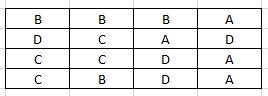
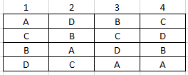
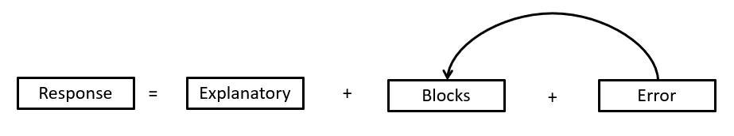
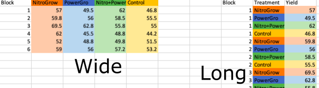

<style type="text/css">
span.boxed {
  border:5px solid gray;
  border-radius:10px;
  padding: 5px;
}
span.invboxed {
  border:5px solid gray;
  padding: 5px;
  border-radius:10px;
  color: white;
}
table, td, th
{
border:0px;
}
</style>


```{r setup, include=FALSE}
library(bio2020)
library(kableExtra)
knitr::opts_chunk$set(echo = TRUE)
peas_dat <- read.csv("Data/peas_block.csv")
```

# Introduction
Now that we have developed a good understanding of linear models we are going to look at some more complex cases. The overall aim is to ensure that you are familiar with the use of linear models and the `lm()` function when you have multiple explanatory variables. This might arise in 'block' designed experiments, mixtures of continuous and categorical explanatories, and curve fitting. You will also have the opportunity to gain more confidence and expertise in manipulating and plotting your data. Specific objectives are to:

1. Explore the use of blocked experimental design, and how to analyse them
2. Understand interaction terms, and how to interpret them
3. Fitting curves to your data with `lm()`
4. Demonstrate how to manage unbalanced designs
5. Allow you to explore some of these ideas with new datasets (optional)


## Refresher on basic concepts
Recall from [Interactive Website on Blocking](https://naturalandenvironmentalscience.shinyapps.io/multiple_explan/#section-blocking) that we use block designs to increase our ability to detect a treatment effect. In the linear models we have looked at so far, there has only been one explanatory variable, so we can think of it as:

$$Response = Explanatory + \epsilon$$
where:

* $Explanatory$ = your treatment, e.g. fertiliser (control, nitrogen, phosphorous)
* $Response$ = dependent variable, e.g. crop growth as a result of fertiliser
* $\epsilon$ = Greek letter Epsilon which stands for the unknown noise or variation in your data

To determine if your explanatory variable has an effect on the response you must **separate the signal from the noise**. Thus if the unknown random variation in your data, $\epsilon$, is too big, then you won't be able to know if your explanatory affects the response.

## Fully randomised design
In a field or laboratory experiment a common design is the **fully randomised design**. For example, you might have:

* 4 types of antibiotic being tested. You have 4 replicate Petri dishes for each antibiotic, and you randomly assign each antibiotic to one of the Petri dishes. You put all 15 Petri dishes on a tray into the incubator.
* 4 varieties of tomato plant are being grown, and you want to measure the chlorophyll content of their leaves. You grow up 4 replicate seedlings of each variety, randomly put them into different pots in a glasshouse
* 3 fertilisers plus a control (4 treatment levels) and you want to understand their effects on growth of pea plants. You allocate the fertilisers at random and later assess the growth of the pea plants.

Now there is nothing wrong with these fully randomised designs, but the problem is that **they are at greater risk of going wrong**. Look at the following setup: you have 4 replicates of 4 treatments, which we'll label A, B, C and D. They are assigned at random:



Purely by chance, most of treatment A is on the right, and most of treatment C on the left. Now transfer this to your experiments:

* The above might represent a plastic tray with Petri dishes in an incubator. The right is next to the door of the incubator. Petri dishes with Treatment A will get more variable temperatures as the door is opened.
* The above might represent your glasshouse. The right might be in the shade, the left in open sun. Tomatoes with Treatment C will have warmer temperatures.
* The above might represent your plots with pea plants. There might be a wet patch of waterlogged soils on the right of the field. Peas receiving treatment A will grow less.

This is going to make it hard to separate the signal from the noise. The unexplained error (noise) will be large and might swamp your analysis, so you can't draw any conclusions:


## Randomised block design
There might be natural variation in your "experimental arena" whether it is a laboratory, glasshouse or field experiment. A fully randomised design is vulnerable to this variation biasing your results. To solve the problem we divide the experimental arena into blocks, and randomly allocate our replicate treatments within each block:

* Divide your laboratory tray into 4 strips with marker pen, arranged so that when you put the tray into the incubator one strip is near the door, the 4th strip near the back of the incubator. Have 4 Petri dishes in each strip, and randomly allocate one of your 4 antibiotics to each of the four Petri dishes.
* Divide your glasshouse into 4 bands from sunny to shady. Within each band, randomly place 4 plant pots containing your four different varieties of tomato.
* Divide your plot experiment with your peas into 4 areas, from the waterlogged soil to the drier soil. Within each area, mark out 4 plots, and randomly allocate the different fertiliser treatments.

Now your design looks like this diagram:



Here the blocks are numbered 1 to 4. Within each block the treatments A, B, C & D are allocated at random. This removes biases due to incubator doors, glasshouse shade or waterlogged fields.

## How does a randomised block design help?
You what to know whether your explanatory variable has an effect on your response, by separating the signal from the noise. The advantage of a randomised block design is that you correct for the environmental or experimental variation in your blocks. Then your model becomes:



Some of the original variation has now gone into the block effect. This reduces the unknown variation (error), so you are **more** likely to detect any relationship between the response and explanatory.

In algebraic terms your linear model is now:

$$Response = Explanatory + Block + \epsilon$$

Where you include an explicit term called $Block$ into your linear model

# Example of a blocked experiment
We will start by using some data that comes from the pea growth and fertiliser experiment mentioned above. The data are available on Canvas in the `peas_block.csv` file and use the `read.csv()` function to import it into `peas_dat`. The data are in "long" format, with different columns for the block, fertiliser type and yield. The data are not arranged in a "wide" grid as in the field (like the diagrams above).

When doing your own projects, wide format might be how you enter it in Excel. Long format is how you analyse it. you'll be pleased to know it's easy to convert between "long" and "wide" formats in R. See the interactive website for this practical for details if interested.



## Initial exploration of pea data
Do some initial explorations of your peas data. You should be able to calculate some simple statistics and visualise it before going ahead with an analysis via a linear model. Do some initial queries to check:

* Overall mean yield across all the plots; use
  + `summary(peas_dat)` which also gives minimum, maximum etc., 
  + `mean(Yield ~ NULL, data=peas_dat)` or
  + `mean(~Yield, data=peas_dat)`
* Standard deviation of `Yield`

**Question** When you used the `summary()` function, what did it return for the `Block` variable and the `Treatment` variable? Does a mean, minimum and maximum value for your `Block` variable make any sense?? How might it be better to record the `Block` variable?

Produce a boxplot similar to this using the `gf_boxplot()` function, combined with `%>%`, `gf_labs()` and `gf_refine()` with `theme_classic()`. Build it up line-by-line, from a basic boxplot, to the more attractive one below:

```{r, echo=FALSE}
gf_boxplot(Yield ~ Treatment, data=peas_dat) %>% 
  gf_labs(x = "Experimental treatment", y = "Yield of peas per plot (g)") %>% 
  gf_refine(theme_classic())

```


## Linear model (two-way ANOVA) of the pea data
### Recoding `Block` and `Treatment`
You may have noticed that when you ran the `summary()` function earlier it returned the minimum, maximum, average etc. of your `Block` variable. This is of course nonsensical. You could just as easily have coded your six blocks A, B, C, D, E and F. Unfortunately, if you leave `Block` unchanged, R will assume it is a continuous variable, and that `Block 6` is "bigger" than `Block 1`. Likewise, the "character" class for `Treatment` is a little confusing, as it does not show the individual fertiliser treatments. We can re-code both variables into factors, and re-run the `summary()` function to see the difference. Remember that the `$` symbol allows us to access individual columns in a table ("data frame") and the `as.factor()` function tells R that the variable is categorical:

```{r}
peas_dat$Block <- as.factor(peas_dat$Block)
peas_dat$Treatment <- as.factor(peas_dat$Treatment)
summary(peas_dat)
```

That is much better. We no longer have silly statistics for the `Block` column, and the individual fertiliser treatments are now being displayed for the `Treatment`. What do the numbers `4` and `6` represent alongside each row of these entries?

### Linear models of pea dataset with and without `Block`
We'll begin with a simple linear model that ignores the `Block` variable, just to demonstrate the improvement afterwards. This is a one-way ANOVA, as there is only one explanatory categorical variable. It is equivalent to analysing your data as a fully-randomised design.

```{r}
pea_dat_lm1 <- lm(Yield ~ Treatment, data=peas_dat)
print(anova(pea_dat_lm1))
```

What do you conclude from this? Do the fertilisers have a significant effect? How would your report these data? Remember that by convention p=0.05 is usually the critical cut-off for "statistical significance" so what would be an appropriate way to report your results? Do a QQ plot of the residuals? Are assumptions of the model robust?

Now repeat but include `Block`. Notice that we are naming our second set of results `pea_dat_lm2`. This is a common convention in R, to end the name of the output with the name of the analysis (here `lm`) and if doing several models to add a suffix `1`, `2` etc. for clarity:


```{r, echo=FALSE}
pea_dat_lm2 <- lm(Yield ~ Treatment + Block, data=peas_dat)
print(anova(pea_dat_lm2))
```
 
Notice how the `Treatment` for your fertilisers is now significant. There are several points to notice here:

* The total Sums of Square (a measure of total variation in your dataset) in the data is unchanged in both `lm1` and `lm2` of your pea yield. See [This Interactive Website](https://naturalandenvironmentalscience.shinyapps.io/how_anova_works/#section-variances-with-categorical-explanatory-variables) to remind yourself of the different components of SS
* The **Residuals** are **much smaller** in `pea_dat_lm2`. Residuals are unexplained noise, or the $\epsilon$ in your data. The smaller you can make the noise, the more likely you are to detect a treatment effect.
* The SS is the same for your `Treatment` in both `pea_dat_lm` and `pea_dat_lm2`
* Variance explained by each term is measured in the column headed `Mean Sq` by dividing the `Sum sq` by `Df` (degrees of freedom)
* The `F value` for the fertiliser treatment is calculated by dividing its `Mean Sq` by that of the Residuals. The bigger the F-ratio the more significant (lower p-value), i.e.
   + F-ratio = Treatment Mean Sq / Residual Mean sq
   + `pea_dat_lm1`  F-value = 86.427 / 30.251 = 2.857 (non-significant)
   + `pea_dat_lm2`  F-value = 86.427 / 17.349 = 4.982 (significant)

So what changed was that we moved some of the variation in your data out of "noise" and into "Block". This allowed us to focus on what we were interested in, namely the fertiliser treatment. As before, check the residuals of your second linear model, and create a QQ plot.

## Which fertiliser treatment is best?
Of course, the above analysis merely shows us that fertiliser has an effect on yield. We also want to know how one fertiliser compares with the others, as well as the Control. So we need to do a Tukey multiple comparison test, using the `TukeyHSD()` function. Try running the `TukeyHSD()` function on the `pea_dat_lm2` results. You'll see that it gives a huge amount of results, because not only does it compare all the pairwise Fertiliser combinations, it also does the same for all the Blocks. We are not interest in Block pairwise comparisons, so we can force the function to only look at the fertilisers via:

```{r, eval=FALSE}
TukeyHSD(pea_dat_lm2, which="Treatment")
```

Next, create a plot of the results of the Tukey test. Ask a demonstrator or member of staff if you are unsure how to interpret the results.

# Interactions terms: when the explanatory variables are not independent
## What are interaction terms?
Interaction terms can be useful in both designed experiments and field surveys. They provide a way of checking whether the effects of two explanatory variables on the response are independent of each other, or alternatively whether the value of one explanatory variable alters what the other one does.

## Basic concepts in the 'goal-oriented' approach
Our original linear model, with two explanatory variables is:

&nbsp;

<center>
<h2><strong><span class="boxed">lm</span> ( <span class="boxed">y</span> ~ <span class="boxed">x1</span> + <span class="boxed">x2</span> , data = <span class="boxed">mydata</span>)</strong> 
</h2></center>

&nbsp;

which can be thought of as:

$$Response = \textit{Explanatory 1} + \textit{Explanatory 2} + \epsilon$$

When we have an interaction term, our model changes to:

&nbsp;

<center>
<h2><strong><span class="boxed">lm</span> ( <span class="boxed">y</span> ~ <span class="boxed">x1</span> + <span class="boxed">x2</span> + <span class="boxed">interaction x1:x2</span>, data = <span class="boxed">mydata</span>)</strong> 
</h2></center>

&nbsp;

and we revise this to:

$$Response = \textit{Explanatory 1} + \textit{Explanatory 2} + \textit{Interaction} + \epsilon$$
 
where:

* $Response$ = dependent variable, e.g. crop growth as a result of fertiliser
* $\textit{Explanatory 1}$ = your first treatment, e.g. fertiliser (control, nitrogen, phosphorous)
* $\textit{Explanatory 2}$ = your second treatment, e.g. pesticide (control, insecticide)
* $\textit{Interaction}$ = measures how response variable changes as a result of **both** first and second treatment
* $\epsilon$ = Greek letter epsilon = the unexplained "noise" in your data
 
The $\textit{Explanatory 1}$ and $\textit{Explanatory 2}$ variables can be continuous and/or categorical. You can express an interaction term in R using the `lm()` function, by adding an extra term with the two explanatories separated by a colon `:` symbol.

Let's look at the example from the [Interactive Website on interaction terms](https://naturalandenvironmentalscience.shinyapps.io/multiple_explan/#section-interactions-between-explanatory-variables)

## Example of interactions: blood plasma calcium in rabbits
Let's look at the example of the blood Ca level in rabbits, half from a lowland agricultural farm, half from an upland farm, split according to gender. Download the file `plasma.csv` from Canvas and import the file into an R table called `plasma_dat`. Now see if you can produce a boxplot similar to the following. **Hints**:

* `gf_boxplot()` is main function
* `gf_labs()` to change default labels
* `gf_refine()` to change overall format of plot

```{r, echo=FALSE}
plasma_dat <- read.csv("Data/plasma.csv")
gf_boxplot(calcium ~ site, colour = ~sex, data=plasma_dat) %>% 
  gf_labs(y = "Blood calcium (mg / 100 ml)", x = "Farm location") %>% 
  gf_refine(theme_classic())
```

 From the plot you can see several trends:
 
 * males seem to have lower blood Ca than females overall
 * in males the blood Ca increases from lowland to upland, whereas for females it decreases
 * the differences between males and females appear to be bigger at lowland than upland farms
 
 You can now create the linear model using `lm()` as usual, but include an interaction term:
 
```{r, eval=TRUE, echo=FALSE}
calcium_lm <- lm(calcium ~ site + sex + site:sex, data=plasma_dat)
print(anova(calcium_lm))
```
```{r, eval=FALSE, echo=TRUE}
calcium_lm <- lm(calcium ~ site + sex + site:sex, data=plasma_dat)
anova(calcium_lm)
```

Notice how your ANOVA table now has **three** rows for the explanatories, namely `site` on the first row, `sex` on the second row, and the interaction term `site:sex` on the third row. When `site` and `sex` are on their own, as on the first and second row, they are referred to as **"main effects"** to distinguish them from when they both occur together in the third row as the **interaction term**. As usual there is of course a final row for the `Residuals` or unexplained noise ($\epsilon$) in your data. You can see three F-ratios (one for each explanatory variable) and associated p-values, the latter under the column headed `Pr(>F)`.

Before reading on, think about these questions:

* How would you report the above F and p-values in a report?
* Which explanatory variables are "statistically significant"?

## How to interpret a linear model with interaction terms
When you have an interaction term as one of your explanatory variables, always look at it **first**. If it is not significant, you might be able to manage with a simpler linear model that does not include interaction terms. It is always best to try and have a simpler rather than overly complex linear model when possible.

However, in this example the interaction term **is** significant. Indeed, you have:

* `site` main effect. $F_{1,16}=0.017, p=0.899$ non-significant
* `sex` main effect. $F_{1,16}=167.658, p<0.001$
* `site:sex` interaction. $F_{1,16}=47.604, p<0.001$

So you can see that both the `site:sex` interaction and `sex` main effect terms are highly significant, whereas the `site` main effect is non-significant. This type of result is not uncommon, but at first glance is very confusing. Why is the `site` main effect unimportant, whilst it seems to have a big impact on blood calcium in the interaction? This seems a little contradictory.

The easiest way to understand the process is to plot individual graphs for each component. See if you can create these graphs on your own.

First of all the `site` main effect:

```{r, echo=FALSE}
gf_boxplot(calcium ~ site, data=plasma_dat)

```

It is fairly obvious that **if we ignore sex** the overall amounts of blood calcium are fairly similar in both the lowland and upland farms although the range of values is smaller in the uplands. A boxplot shows the median as the middle horizontal line (try calculating the means for comparison) and these are quite close to each other. This explains the non-significant `site` main effect.

Second, the `sex` main effect, **if we ignore site**. Produce a graph similar to the following:

```{r, echo=FALSE}
gf_boxplot(calcium ~ sex, data=plasma_dat)
```

Now the sets of values are very different, with the males much lower overall than the females, which explains the large F-ratio and highly significant (p<0.001) results for `sex` main effect.

Finally, the interaction term. As this graph is a little trickier to draw, I have included the R code. We include both the raw data, and lines connecting the means, to show the direction of change:

```{r}
# gf_point() adds the raw data points
# gf_line() adds lines. We use stat="summary" to indicate the mean
gf_point(calcium ~ site, colour= ~sex, data=plasma_dat) %>%
  gf_line(calcium ~ site, colour= ~sex, group= ~sex, stat="summary", data=plasma_dat)
```

The important point to note here is that **the lines are not parallel**. If the lines were parallel, either upwards or downwards, it would indicate that the blood calcium changed in a similar way for both genders when moving from lowland to upland farms. However in reality they are not parallel, indeed the differences are so big that the gradients of the lines go in opposite directions. This indicates that the physiology of male and female rabbits in response to the elevation change is not the same. When you look at plots like this:

* lines not parallel (as here): interaction is probably significant
* lines parallel (not in this example): interaction probably non-significant

To explore these data more [look at this interactive webpage](https://naturalandenvironmentalscience.shinyapps.io/multiple_explan/#section-interactive-demonstration). This uses the same data, but you can randomly adjust some of the terms, and see how the results change. Begin by setting the interaction term to zero, and notice the difference.

# Using linear models to fit curves
How can a linear model fit a curve? The term "linear model" simply refers to the way in which the different explanatory variables are combined. They are all combined using simple addition symbols `+`, for example, your model:

`calcium_lm <- lm(calcium ~ site + sex + site:sex, data=plasma_dat)`

from earlier has two `+` symbols on the right-hand side. By adjusting some terms in the explanatories you can fit curves (see below). In BIO2020 we will only use linear and generalised linear models. We will not use non-linear models.

## Data transformation or polynomials?
It is much easier to fit a straight line than a curve, but often an initial exploration of your data by plotting it will reveal that a straight-line does not provide a satisfactory model. The two main approaches to resolve this are to:

1. A simple mathematical transformation of your data to bring it back to a straight line. Commonly used transformations are logarithmic `log()` and square-root `sqrt()` of your response variable.
2. Use a polynomial linear model, by adding extra explanatory variables calculated from the first explanatory variable. The explanatories thus become $x$, $x^2$, $x^3$ etc.

The use of both methods is somewhat controversial. Mathematical transformations can make it harder to understand and interpret the results, especially if there is not an obvious biological basis for the transformation. High-order polynomial terms such as $x^3$ and $x^4$ will create attractive smooth curves, but have little biological meaning. Conversely, some mathematical transformations are so common you probably never even think about them: **pH** is actually the log-transformation of hydrogen ions; these have a skewed 'log-normal' distribution by default, so taking a logarithm to create the pH scale makes sense. You can also end up with skewed data when you have counts of a response variable, since you cannot have negative counts. It used to be common to log-transform count data using `log(y+1)` (in case there are any zeros). Here we will focus on a polynomial example to fit a curve.

## Polynomial linear model: quadratic for simple curves
The word "polynomial" simply indicates that we are going to derive new $x^2$ (x-squared), $x^3$ (x-cubed) etc. terms to put into our linear model in order to fit a curve. Due to problems of biological interpretation, it is very rare to go beyond a simple **quadratic** model:

$$\textit{Response variable}=\textit{Explanatory variable}+\textit{Explanatory variable}^2 + \epsilon$$
where

* $\textit{Response variable}$ = dependent, y-axis variable
* $\textit{Explanatory variable}$ and $\textit{Explanatory variable}^2$ = independent, x-axis variable, either in its original form, or squared.
* $\epsilon$ = Greek letter epsilon for unknown noise or variation in your data.

These are easy to create using the `lm()` function using:

`lm(response ~ explanatory + I(explanatory^2), data=dataset_name)`

The slightly confusing change to the usual syntax is that `^2` is used to indicate that we are going to add a squared explanatory, and we have to "wrap" the squared term in an extra set of brackets prefaced by `I()` to indicate that we "Intend" to do this, and it isn't a typing error.

## _Lolium_ growth example
Let us build on the example at the [Interactive Website on Curve fitting](https://naturalandenvironmentalscience.shinyapps.io/multiple_explan/#section-fitting-curves) for growth of the grass _Lolium perenne_ in soils of different water content. You will need to first:

* dowload the file `grass_growth.csv` from Canvas
* copy `grass_growth.csv` into your `Data` folder
* import it into R using `read.csv()` as a table called `lolium_dat`

Use the `head()` function to look at the first few rows, or double-click on `lolium_dat` in the "Environment" pane (top-right of RStudio) to view the whole table of data. Next, produce a scatterplot of the data:

```{r, echo=FALSE}
lolium_dat <- read.csv("Data/grass_growth.csv")
```

```{r, echo=TRUE}
gf_point(growth ~ water, data=lolium_dat) %>% 
  gf_labs(x = "Soil water content (%)", y="Growth rate") %>% 
  gf_theme(theme_classic())
```

You can see that whilst the pattern of points is broadly increasing, but beyond about 75% soil water it starts to drop sharply. _Lolium_ is not an aquatic plant, so this makes sense biologically of course. 

### Simple (straight line) linear model
Let's look at a simple straight-line linear model to begin. This model is of the form:

$growth = water + \epsilon$

```{r, echo=TRUE}
lolium_lm1 <- lm(growth ~ water, data = lolium_dat)
summary(lolium_lm1)
```

So that was easy! You have a highly significant linear model, showing that _Lolium_ growth increases with water content. The overall model is significant with $F_{1,17}=11.45, p=0.004$, and the $R^2=0.367$ (model explains 36.7% of variation). But... we should always check model assumptions by looking at the residuals to see if there are any abnormalities.

### Diagnostics for simple (straight line) linear model
We can actually produce 4 "diagnostic" plots quite easily with the `plot()` function, writing `plot(lolium_lm1)`. Only the first two are really useful here. The `plot()` function extracts the residuals and creates a QQ plot automatically. All the plots look at "Residuals". Remember residuals are the differences between your fitted straight line and the observed points.

```{r, echo=TRUE, eval=TRUE}
plot(lolium_lm1, which=1:2) # We only want the first two diagnostic plots
```

* The first plot is called **Residuals vs Fitted**. Notice how it bends down at both low and high fitted values, with the residuals drifting away from zero, whereas ideally the scatter around should be fairly constant.
* The second plot, titled **Normal Q-Q** is the quantile-quantile plot you have created manually before. Notice how poorly the points align with the expected dotted line, especially at the extremes.

### Add the fitted line to see the problem
If you modify your plot, by adding a line via the `gf_lm()` function, the problem is obvious:

```{r, echo=TRUE}
gf_point(growth ~ water, data=lolium_dat) %>% 
  gf_labs(x = "Soil water content (%)", y="Growth rate") %>% 
  gf_lm() %>% 
  gf_theme(theme_classic())
```

Thus, by looking at the raw data, especially when you overlay the fitted line, as well as the diagnostic residual plots from the model, as well as basic plant biology, you can see this is not a good model. Let's change it to a curve, by changing it to a quadratic.

### Quadratic (curve) linear model
This means our model is now of the form:

$growth = water + water^2 + \epsilon$

which we can express in R as:

```{r, echo=TRUE}
lolium_lm2 <- lm(growth ~ water + I(water^2), data = lolium_dat)
summary(lolium_lm2)
```

This linear model is also significant. You will notice that the overall model is highly significant with $F_{2,16}=64.37,p<0.001$ and $R^2=0.876$, or 87.6% explained. **Note** In the previous sentence the p-value is written as $p<0.001$ which indicates "p is less than 0.001". This is because in the overall linear model output it the p-value is shown as `p-value: 2.23e-08` which is the same as $p=0.0000000223$. The convention is that for tiny p-values, the actual amount is not shown, and instead the "less than 0.001" syntax is used.

Is the improvement in the overall model of `lolium_lm2` compared to the earlier `lolium_lm1` significant? We can compare the two models using `anova()`:

```{r, eval=FALSE, echo=TRUE}
anova(lolium_lm1, lolium_lm2)
```
```{r, eval=TRUE, echo=FALSE}
print(anova(lolium_lm1, lolium_lm2))
```


This is a test to compare our two linear models, and it gives $F_{2,16}=70.48, p<0.001$ indicating that there is a big difference in the performance of our two models, with our second one, labelled `Model 2` in the above output, better. Notice also the column headed `RSS` which stands for "Residual Sum of Squares". This is a measure of the "noise" that is not explained by our model. You can see that it is much smaller at 146.81 for the second model.

### Coefficients from quadratic model `lolium_lm2`
Look at the column headed `Estimate` in the `summary(lolium_lm2)` above. All three estimates, the `(Intercept)`, the `water` and quadratic `I(water^2)` terms are significant, but their values are very different, at 10.716, 1.067 and -0.009 respectively. It is common for the absolute value of the squared term to be very small. **Questions**:

* Why is the value of the estimate for the squared term so small? Why might this be? 
* Why does the squared term have a negative value?
* How does the value of `water^2` change as you square the value of water?

Ask on Microsoft Teams if unsure, under the "Section 3 - Dealing with multiple explanatories" channel.

### Diagnostics and plots from quadratic model `lolium_lm2`
Replot the first two diagnostic from `lolium_lm2` and you can see that both of these are improved compared to the original.

```{r, echo=FALSE}
plot(lolium_lm2, which=1:2)
```

Finally, let's plot the raw data, plus our quadratic model with confidence intervals. By default, the `gf_lm()` function adds a straight line, but if we give it the same quadratic we used in the model, it will add a curve.

```{r}
gf_point(growth ~ water, data = lolium_dat) %>% 
  gf_lm(formula = y ~ x + I(x^2), interval = "confidence")
```

This looks much better and more realistic. It is a better statistical model, and also makes more biological sense. Before you go further, try modifying this plot so that the horizontal axis is labelled "Soil wated %" and the vertical axis "Growth rate".

# Unbalanced designs
Unbalanced designs occur regularly in biology - the term 'unbalanced' simply means that you don't have the same number of replicates in each of your treatment levels. This can make the interpretation of the analyses a little trickier. Ideally you would have the same number of replicates in every treatment level, but sometimes for practical reasons this may not be possible. Experimental error may also cause problems, e.g.

* contamination of some Petri dishes in a laboratory experiment
* death of some plants in a glasshouse experiment
* vandalism of some experimental plots in a field experiment (this has happened to me!)

## Revisit the blood calcium rabbits dataset
An easy way to demonstrate the problem that unbalanced data causes is to go back to our Ca in rabbits example, but deliberately remove one row of data to make it unbalanced. Perhaps one of our tagged rabbits was eaten by a fox...

In the R commands below, the `[]` syntax allows us to refer to individual rows and columns of a table. For example, `plasma_dat[3, 2]` would find the number in the 3rd row and 2nd column of the table of data in `plamsa_dat`. The description `plasma_dat[-4,]` means "omit the 4th row". As we did not add anything after the `,` it keeps all the columns. Have a look at the [Data Frames](https://naturalandenvironmentalscience.shinyapps.io/RstudioInstall/#section-working-with-data) section of the Interactive Website as a refresher.

```{r, eval=FALSE}
# Omit the 4th rabbit to create an unbalanced dataset
plasma_dat_unbal <- plasma_dat[-4,]


# Compare the number of records in each replicate
tally(~ site + sex, data=plasma_dat) # Original
tally(~ site + sex, data=plasma_dat_unbal) # Unbalanced
```

The `tally()` function counts up the numbers of replicates in each of the 4 combinations of explanatory variables, and whereas the original data shows you 5 replicates in every combination, in the second `plasma_dat_unbal` dataset (greedy fox), there are only 4 upland females. **Note**: we don't need to include a `calcium` response variable on the left of the `tally()` function, since we are focussing on the explanatories.

Now repeat the earlier analysis from "Example of interactions" but with the unbalanced data. Do the analyses with the interaction term last, but change the order of the main effects:

```{r, eval=FALSE}
plasma_unbal_lm1 <- lm(calcium ~ sex + site + sex:site, data=plasma_dat_unbal)
plasma_unbal_lm2 <- lm(calcium ~ site + sex + sex:site, data=plasma_dat_unbal)
anova(plasma_unbal_lm1)
anova(plasma_unbal_lm2)
```

The two analyses produce identical results for the `site:sex` interaction term, but not for the `site` and `sex` main effects. This is common with unbalanced data, and sometimes variables can change from being significant to non-significant. **Repeat**: Try the same two analyses again with the original balanced `plasma_dat` dataset and you will see that in contrast the order in which you enter the variables has no effect when you have "balanced" data.

## Using different Sums of Squares (SS) with unbalanced data
By default R uses "sequential" sums of squares (SS) when calculating the values for an ANOVA table. Sequential SS are sometimes called "Type I" tests. There are several different methods of calculating SS, all with their advantages and disadvantages. Sequential SS is usually best with balanced data, but does not work properly with unbalanced data. See [this recent paper](https://besjournals.onlinelibrary.wiley.com/doi/full/10.1111/j.1365-2656.2009.01634.x) for a comparison of the different types of SS from a biological perspective.

The easiest correction is to apply "adjusted" sums of squares, which give the same result irrespective of the order in which you enter the variables. This is available via the `Anova()` function (captial letter A), which is in the `car` package, which should be automatically loaded via the `bio2020` R package. Try the following:

```{r, eval=FALSE}
Anova(plasma_unbal_lm1)
Anova(plasma_unbal_lm2)
```

You can now see that it does not matter what order you put the explanatories into your linear model, and the result is the same. **Note**: This problem can sometimes arise if you have a mixture of continuous and categorical explanatory variables, and therefore you may wish to use `Anova()` rather than `anova()` in those circumstances.

You might be wondering, "Why not use Type II tests all the time?". Some statistics packages do indeed use Type II tests as their default, and there is nothing wrong with them. However, if you have balanced data, Type II tests tend to be slightly less powerful. In other words, they are not quite as good at detecting a treatment effect compared to the default Type I test. Of course, this depends on you having balanced data!

# Take home messages from today's practical
These are the key things you should have learnt:

1. Randomised-block designs, and why they can be useful when planning your experiments
2. How to measure whether two (or more) explanatory variables are independent in their effects via interaction terms
3. How to fit curves using a quadratic model
4. What to do if you have unbalanced data

If you have any questions about these four topics, pop them into Microsoft Teams.