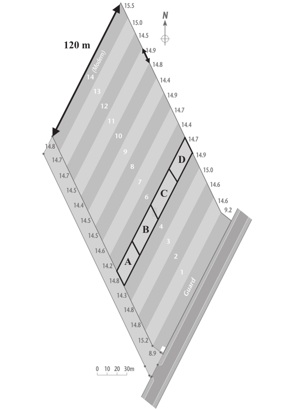
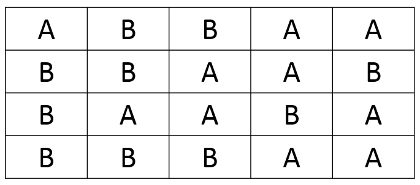
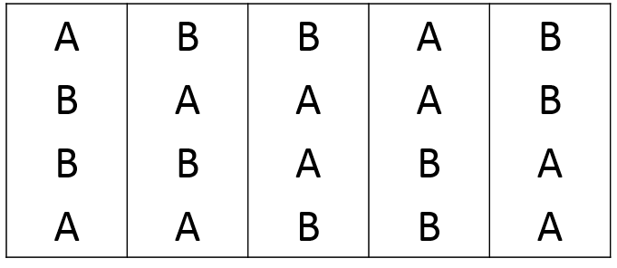
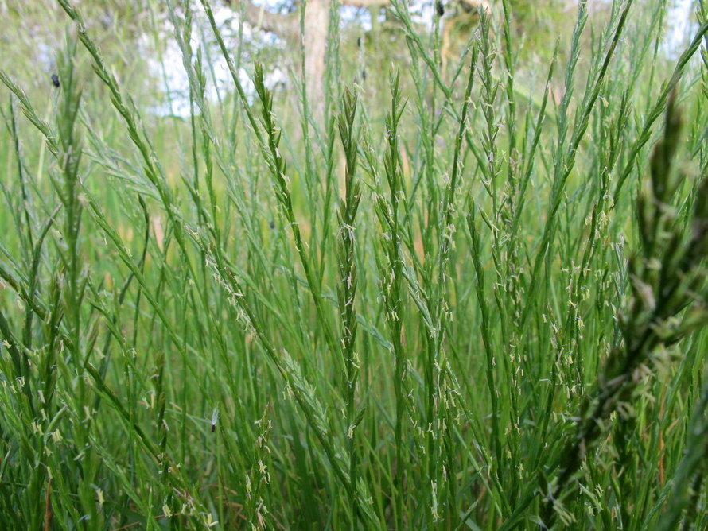

```{r setup, include=FALSE}
library(learnr)
library(mosaic)
library(tidyr)
library(magrittr)
plant_growth <- read.csv("www/plant_growth.csv")
lolium <- read.csv("www/grass_growth.csv")
plasma <- read.csv("www/plasma.csv")
knitr::opts_chunk$set(echo = FALSE)
```


## Multiple explanatory variables

### Introduction
You will often collect data where you have more than one explanatory variable,
and there are two particular areas where this might arise:

* Designed experiments
* Surveys or 'natural' experiments

**Designed experiments** are typically laboratory studies where you have
considerable control over the structure of the study, the number of replicates,
the different treatment(s) used etc. Designed experiments can also be plot-
based agricultural experiments, or animal behaviour experiments. In contrast,
**natural experiments** may arise where you want to study species distributions,
ecological characteristics or wildlife patterns in as natural and un-modified
situation as possible. This of course results in you having less ability to
decide what variables to include, because there may be numerous factors in the
environment that are affecting the species you are studying.

## The value of randomisation
The simplest type of experimental design includes some sort of randomisation, and
can be used in both laboratory- and field-experiments. Randomisation is useful for
both 'designed' and 'natural' experiments. The need for multiple replicates may
seem fairly obvious to you, but think about one of the world's oldest agricultural
experiments, the Palace Leas Experiment at Cockle Park, which many of you will have
visited:


Thos of you who have visited the site will know that it slopes gently down a
hill away from the farm lane, down towards a stream, with a series of 14 
roughly rectangular shaped plots receiving different treatments:



Some treatments are replicated (for different years in the rotation cycle
for treatments) but not all of them are replicated. In fact, standard theories on
good practice for experimental design had not been developed when the Palace Leas
experiment was started. Since the start of the experiment, changes to sampling
methods have eased some problems, by dividing each long rectangle into 4 sub-units
for sampling, but there remain some problems, and advanced statistical methods
are sometimes needed.


```{r palace_leas, echo=FALSE}
question("What do you think are some of the challenges that arise from the original
         design? (select ALL that apply)",
  answer("There may be an effect from being near the road", correct = TRUE),
  answer("There is no replication"),
  answer("Plots near the stream may be wetter", correct = TRUE),
  answer("There is the risk of manure or slurry run-off from the road", correct = TRUE),
  answer("Multiple samples cannot be taken within a plot"),
  answer("Samples within a plot might not be independent", correct =TRUE)
)
```

## Ways to randomise your treatments
### Fully randomised design
There are several methods of creating multiple replicates of your experimental 
units and randomising the allocation of treatments to them. To give you some
examples:

1. You might want to investigate the effect of a new antibiotic on bacterial growth.


     
   + Your **experimental units** could be Petri-dishes on which you grow bacteria.
   + Your **response variable** is bacterial growth
   + Your **explanatory variable** has is a categorical 'factor': no antibiotic, your new antibiotic

2. You are interested in the effects of _Rhinanthus minor_ on species diversity
in grasslands. _Rhinanthus_ is a parasite of grasses, and therefore reduces their
vigour. This allows other species of wildflower to colonise the grassland.

     + Your **experimental units** could be different plots in a meadow, each 10 x 10 m
     + Your **response variable** is the overall diversity of wildflowers
     + Your **explanatory variable** is a factor with two categories: a control, and plots with
_Rhinanthus_ seed growing

You can probably think of other studies where you have explanatory variables with
3, 4 or more categorical levels in them.

You decide to create a simple fully randomised design experiment, with 5 replicates
for each of your two treatments. So for the antibiotic experiment, you have 5 Petri
dishes without antibiotic (control), and 5 with your new antibiotic, and you put
these onto a plastic tray in the incubator.  For the _Rhinanthus_ experiment you
have 5 plots in your field without any _Rhinanthus_ seed added (control), and 5
with the seed. You toss a coin to allocate treatments to Petri dishes or plots,
and end up with the following design.



```{r fully_randomised, echo=FALSE}
question("What do you think is the problem with this design; A is your control
         (no antibiotic, or no Rhinanthus) and B treatment (antibiotic or 
         Rhinanthus)",
  answer("There are not enough replicates", message = "Although replication is
         low, it might be sufficient, especially if you have done pilot studies"),
  answer("There are only two treatment levels in the explanatory variable. You 
         need at least three, e.g. different concentrations of antibiotic, or
         different seed sowing rates", message = "Only 2 levels in your explanatory
         variable is sufficient"),
  answer("Most of the control Petri-dishes or plots are at one end of the tray
         or field respectively", correct = TRUE, message = "Good. This may bias
         your results"),
  allow_retry = TRUE
  )
```

Think back to the Palace Leas experiment, which was on a slope. Even if it had
originally been created as a fully randomised experiment, it would not be ideal
if most of the plots for one of the fertiliser treatments plots had ended up,
purely by chance, by the road or by the stream. Likewise, temperatures in an
incubator are less stable near the door than at the back of an incubator. If most
of your Petri-dishes for the antibiotic were, purely by chance, near the door
then that might bias your results.

Of course you could eventually get round this problem by greatly increasing the
number of replicates. But that would be expensive and time-consuming. Instead
you can slightly change how you set up your experiment, so that it is more robust,
yet use no more resources.

## Blocking
### Introduction
Sub-dividing your experimental 'space' into 'blocks' can often improve the power
of your experiments, without the need for any additional time, replicates or
resources. Take a look at the following diagram, which represents the same
experiment as before, i.e. the units are Petri dishes arranged on an incubator
tray with/without antibiotic, or field plots with/without _Rhinanthus_ seed.



The experiment is now arranged as having 5 'blocks' from left-to-right. Within
each block there are 2 replicates for each treatment, but their arrangement
within these blocks is completely random.

### How does blocking help?
Imagine the left-hand side of the grid in the diagram above is next to the door
of the incubator, or farm track in the field experiment. Hopefully you can see
both treatments occur close to the door, or farm track, and both treatments are
also preset at the back of the incubator or a long way from the farm-track at
the right-hand side of the grid. This didn't happen in the earlier fully
randomised design, so is an immediate improvement.

This improved design also increases your ability to detect whether your treatments
are actually doing anything. In a linear model, your overall pattern is:

$$\text{Response} = \text{Explanatory variable} + Error$$
where in these examples you have

$$\text{Response} = \text{Explanatory variable} + Error$$
where the $Error$ is the unknown variation or 'noise' in your data. In these 2
examples you have
$$\text{Bacterial growth} = \text{control/antibiotic} + Error$$
and
$$\text{Wildflower diversity} = \text{control/Rhinanthus} + Error$$
Remember that you have two columns, one with your response variable, and one with
your explanatory variable, with each row of the latter categorised into which 
treatment 'level' is applied.

The overall importance of your explanatory variable is determined by the amount
of variation it explains relative to the amount of unknown $Error$ variation. Recall
that the F-value in an ANOVA table is based on the ratio of mean squares (variances)
in your explanatory variable : error. **Key points** arising from this are:

* If the $Error$ is large it is going to be harder to detect an effect from your
explanatory variable
* The $Error$ might be increased due to changes across your experimental units,
for example whether your Petri dishes are near the incubator door, or your field
plots are near the road
* If you explicitly account for this systematic variation across your experiment,
you can **reduce** the $Error$ and **increase** your ability to detect an effect
from your explanatory variables.

So, you can replace your original linear model:

$$\text{Response} = \text{Explanatory variable} + Error$$
with this one:

$$\text{Response} = \text{Explanatory variable} + \text{Block} + Error$$
In the second linear model the $Error$ will be smaller, as some of the variation
is accounted for by Block. As a result, you are more likely to find an effect
from the explanatory variable.

**Add a revision question**

## Worked example of randomised blocks
Here is a simple experiment to investigate the effects of nitrogen (N) and
phosphorous (P) on plant biomass. There are four blocks, and also an untreated
control. The following exercise contains the results in a data.frame called
`plant_growth`, read in as a 4 row (blocks) by 4 column (block, control, N, P).
Create two boxplots, one showing the differences in biomass according to treatment.

**Hints**:

* re-arrange the data so that they are in a 3 column table called `plant_growth_lng`
using the `pivot_longer()` function.
* Use the `gf_boxplot()` function to create the plot.

```{r biomass_boxplot-setup}
# Avoid confusing with other data.frames
rm(lolium)
rm(plasma)
```

```{r biomass_boxplot, exercise=TRUE}

```

```{r biomass_boxplot-solution}
plant_growth_lng <- pivot_longer(plant_growth,
                                 cols = Control:P,
                                 names_to = "fertiliser",
                                 values_to = "biomass")

gf_boxplot(biomass ~ fertiliser, data=plant_growth_lng)
```

Before we go any further, do a quick `summary` of the data in your `plant_growth_lng`
dataset.

```{r coding_of_blocks, echo=FALSE}
question("What additional change is needed before you can analyse the data with
         a linear model?",
  answer("The blocks need to be recoded A to D", message = "Not essential, although
         if they had originally been coded as A to D rather than 1 to 4 this extra
         step would not be needed"),
  answer("The biomass values need to have units", message = "R can undertake the
         calculations without the need for units, but when displayed in a graph
         it is good practice to show the units"),
  answer("The rows need to be re-ordered to match their arrangement in the
         field", message = "No, you would only need to do this if you had large
         amounts of data and wanted to do a very complex spatial analysis."),
  answer("The summary() function gave min,mean,max values for the blocks. This
         suggests they are not being read by R as categorical", correct = TRUE,
         message = "R has interpreted the blocks as a continuous explanatory
         variable, whereas it should be categorical."),
  allow_retry = TRUE
  )
```

In the following exercise do the following with the `plant_growth_lng` dataset:

* recode the `block` variable to be categorical. **Hint**: use `as.factor()` function;
Use the `summary()` function before and after re-coding to check the differnce
* create a linear model `plant_growth_lm1` with only fertiliser as the explanatory
variable
* create a linear model `plant_growth_lm2` with both fertiliser and block as
explanatory variables
* compare the Anova tables for each model

```{r biomass_lm_setup}
plant_growth_lng <- pivot_longer(plant_growth,
                                 cols = Control:P,
                                 names_to = "fertiliser",
                                 values_to = "biomass")
rm(plant_growth)
rm(lolium)
rm(plasma)
```
```{r biomass_lm, exercise=TRUE, exercise.setup = "biomass_lm_setup"}

```
```{r biomass_lm-solution}
# summary() function shows R mis-interprets block as continuous
summary(plant_growth_lng)

# Use the as.factor() function to ensure R recognises block as categorical
plant_growth_lng$block <- as.factor(plant_growth_lng$block)
summary(plant_growth_lng)

# Create your two linear models
plant_growth_lm1 <- lm(biomass ~ fertiliser, data=plant_growth_lng)
plant_growth_lm2 <- lm(biomass ~ fertiliser + block, data=plant_growth_lng)

# Check their ANOVA tables
anova(plant_growth_lm1)
anova(plant_growth_lm2)
```

Look at the output from the two `summary()` functions (use the Solution button
if you get stuck) and note how R codes the blocks correctly after using `as.factor()`.
The `$` symbol allows you to reference an individual column by name in R.

Study the two ANOVA tables.
```{r compare_anova_tables, echo=FALSE}
question("Which of the following statements about the ANOVA tables are true? (select ALL that apply)",
  answer("The variance for fertiliser is the same in both tables", correct = TRUE),
  answer("There is no replication"),
  answer("The residual sums of squares in the first ANOVA = the residual SS + 
         block SS in the second ANOVA", correct = TRUE),
  answer("The total degrees of freedom in both tables is the same", correct = TRUE),
  answer("There is a significant change in the biomass depending on the position
         in the field where the experiment is undertaken", correct = TRUE),
  answer("The F-value is higher for the fertiliser treatment when blocks are used
         because the residual variance is smaller", correct =TRUE)
)
```

### Other examples of where blocks might be used
There are lots of other ways in which you can use blocks to improve your experiment
Examples might include:

* If an experimental unit is an individual plant or animal, group (block) your units 
according to their initial weight
* Birds might be blocked according to initial size, or initial egg batch, or
laying date
* Nesting sites might be blocked according to distance from urban areas
* Glasshouse plants might be blocked according to light intensity in different
parts of the glasshouse

Some of these 'blocking' variables are on continuous scales, such as distance
or light intensity. You can sub-divide a continuous scale into discrete categories
to help you block experiments if you want to eliminate that variable from your
experiment.

It is possible to block with 2 (or more) variables to get rid of the effect of
multiple unwanted variables. These are referred to as _Latin square_ designs
for 2 variables, or _Latin hypercubes_ when there are lots of variables. Given
the Star Trek/Star Wars name of the latter, you'll be glad we won't go into them
in this module.

## Fitting curves
### Using 2 explanatory variables to fit curves
Sometimes you may want to fit a curve rather than a straight line to your data,
and with very simple datasets this can easily be done by creating a second
explanatory variable derived from the original. This is easiest to explain by
an example.

You have undertaken an experiment to investigate the growth rate of common
ryegrass _Lolium perenne_ in a glasshouse experiment with soils with different
water content. Unsurprisingly, growth rate is poor in very dry soils, but it
also declines again in very wet soils.



```{r lolium_scatter, echo=FALSE}
gf_point(growth ~ water, data=lolium) %>% 
  gf_labs(x = "Water content", y = "Lolium growth") %>% 
  gf_theme(theme_classic())
```

Go ahead and fit a standard linear model. Check its `summary` table, and also look
at the model diagnostics, in particular the QQ-plot, and how the model residuals
change with predicted (fitted) growth rate.

**Hints**

* The exercise contains a data.frame called `lolium` with two columns, `growth`
and `water`.
* Use the `lm()` function to create your model, and `summary()` to display
intercept, gradient, R-squared etc.
* Use the `plot()` function of your model object; this will create 4 plots, but
focus on the first (Residuals vs Fitted) and second (QQ plot)

```{r lolium_straight_line-setup}
rm(plant_growth)
rm(plasma)
```
```{r lolium_straight_line, exercise = TRUE, exercise.lines=15}

```
```{r lolium_straight_line-solution}
# Create a simple linear model and check its summary statistics
lolium_lm1 <- lm(growth ~ water, data=lolium)
summary(lolium_lm1)

# The plot function displays 4 plots. You are most interested in the first two
plot(lolium_lm1, which = 1:2)
```

### Interpretation
Whilst you have a significant model, that explains almost 40% of the variation
based on the R-squared, it is obvious that something is wrong. The fitted vs
residuals plot shows a steep curve, whereas ideally they should be scattered
randomly. The standardised residuals in the QQ plot does not follow the 
expected theoretical quantiles very well. These both suggest your model is poor.
Finally, we can plot the predicted model line

```{r lolium_straight_line_plot, echo=TRUE}
# Display raw data and predicted line
gf_point(growth ~ water, data=lolium) %>% 
  gf_lm()
```

Hopefully you can see that a straight line is not very good for these data.

### Fitting a quadratic
A straight line regression model such as this can often be described as:

$$ y = a + b.x + Error$$
where
$y$ = response variable (growth)
$a$ = interecept of fitted line on y-axis (26.0 from your `summary()`)
$b$ = the gradient of the line (0.194 from your `summary()`)
$Error$ = unknown noise around your line.

We can easily modify this equation by adding an additional x predictor that is
simply the square (raised to 2) of the original x:

$$y = a + b.x + c.x^{2} + Error$$
An additional coefficient, $c$ is now calculated. This will typically be a very
small value, in this example with a negative sign. This means that when water
content is low, the $c$ value will do little. For example when water content is
5%, water content-squared is only 25. However, the effect of water content
goes up very sharply with high values: e.g. when water content is 75, water
content-squared is 5625. This will have the effect of 'pulling' your fitted
line back down.

We can try it now. To tell R that you want to square a value in the `lm()` 
function, you need to enclose it in the `I()` function, to indicate that this is
what you intend to do. You can raise a variable to the power of 2 by using `^2`:


```{r lolium_quadratic, echo=TRUE}
# Original linear model
lolium_lm1 <- lm(growth ~ water, data=lolium)

# Include both water and water-squared
lolium_lm2 <- lm(growth ~ water + I(water^2), data=lolium)
summary(lolium_lm2)

anova(lolium_lm1, lolium_lm2)
```

**Key things to note from above**

* The R-squared has jumped to 87.6%
* Three coefficients are produced, for the intercept, water, water-squared. As
expected the water-squared coefficient is very small and negative (-0.008) but
nevertheless highly significant (P = 0.000000295, report as P<0.001)
* We have used the `anova()` function to compare the two linear models. This shows
that the two models differ (F=70.48, P<0.001), with much lower residual sums of
squares in the model containing water-squared.

You can view the predicted line and see the improvement. Simply add the overall
structure of your model (in `y ~ x + I(x^2)` syntax to the `gf_lm()` function.
We have also used the `interval = "confidence"` option to add 95% confidence
intervals around our fitted line:

```{r fitted_line, echo=TRUE}
gf_point(growth ~ water, data = lolium) %>% 
  gf_lm(formula = y ~ x + I(x^2), interval = "confidence")
```

### Polynomial curve fitting: be cautious
The type of linear model you have just fitted is often called a **quadratic**
model, as it contains the original, and squared terms for predictors. There
is nothing to stop you fitting `x^3`, or `x^4` terms to fit more and more 
complex curves. However, be very cautious about fitting such general **polynomial**
models, as the `x^3` or `x^4` terms are unlikely to have any biological meaning.

### Handling regular patterns over time
Sometimes you might have data that shows a regular rise and fall, e.g. temperature
data recorded every hour over the course of several weeks. To analyse such data
you might want to remove the daily cycle, so that you can study other effects.
Using the sine and cosine of your explanatory variable (hour of day) can be an
effective trick. Simply create a model of the form:

$$temperature = sine(\frac{2 \pi}{24.hr})  + cosine(\frac{2\pi}{24.hr}) + Error$$
Similar methods can be used if working with weekly data (divide by 52.week number)
or monthly data (divide by 12.month number)

**Decide whether to expand with a worked example. Possibly omit for Stage 2 students**

## Interactions between explanatory variables
### Interactions
When you have multiple explanatory variables they may not always be independent
of each other, and they 'interact' in some way. This means that the effect of one
explanatory variable on the response also depends on the value of the other
explanatory variable. These interactions can arise when all your explanatory
variables are categorical, when they are all continuous, or where you have a
mixture of categorical and continuous explanatory variables.

### Example with categorical explanatories
The amount of calcium in blood plasma samples (mg / 100 ml) was measured in
male and female rabbits, half sampled from a lowland intensive arable farm, and
half from an upland mixed farm.


As usual it is useful to plot the data before analysing them. As we have 
categorical variables, a boxplot is informative, but we can easily colour code
the boxes two show all four combinations in one plot:

```{r plasma_boxplot, echo=TRUE}
gf_boxplot(calcium ~ site, color= ~ sex, data=plasma)
```

**Key points**

* Use the `colour= ~sex` option in `gf_boxplot()` to arrange the colour-coding.
* You could easily put gender on the x-axis, and colour-code by lowland/upland
* Calcium levels appear to be lower in males than females
* The difference between males and females appears to be bigger at lowland
than upland sites

It is that last point that is critical. Indeed, if you were to a draw line
connecting the two boxplots for the males and a second line connecting the two
boxplots for the females, the gradients of those lines would not be parrallel.
This suggests non-independence, i.e. an **interaction** is present.

## How to test for an interaction
It is easy to test whether an interaction occurs, by adding a third explanatory
variable. Your original model is:

$$Response = Explanatory1 + Explanatory2 + Error$$
which is modified to:
$$Response = Explanatory1 + Explanatory2 + Interaction + Error$$
For this rabbit example, the latter is therefore:
$$calcium = site + sex + site\ sex\ interaction + Error$$
This can easily be entered into the `lm` function, using the `:` operator to
define the interaction term. Put the interaction term last.

```{r plasma_lm_interaction, echo=TRUE}
calcium_lm <- lm(calcium ~ site + sex + site:sex, data=plasma)
anova(calcium_lm)
```

You can see from the ANOVA table indicates that:

* the `site` main effect is **not significant** as P=8.985896e-01 = 0.896. There is **no difference** in the average calcium at the upland and lowland sites
* the `sex` main effect **is significant** as P=0.000000000678 < 0.001. There is **more calcium** in the blood of females than males
* the `site:sex` term **is significant** as P=0.00000356 <0.001. The amount of calcium depends on **both site and gender**

That last bullet point might seem confusing at first. If `site` on its own is
not significant, how can the interaction `site:sex` be significant? Let's look
at the three components and plot them

```{r separate_plots, echo=TRUE, warning=FALSE}
# Main effect for site
gf_boxplot(calcium ~ site, data=plasma)

# Main effect for sex
gf_boxplot(calcium ~ sex, data=plasma)

# Show original data, and lines connecting the two sets of means
gf_point(calcium ~ site, colour= ~sex, data=plasma) %>%
  gf_line(calcium ~ site, colour= ~sex, group= ~sex, stat="summary", data=plasma)
```

**Key points**

* The boxplots for site overlap considerably, hence non-significant `site` main
effect
* Boxplots for sex show little overlap, hence significant `sex` main effect
* lines connecting the means for the two groups **are not parallel** hence
significant interaction term

### Should I drop the non-significant site main effect from the model?
You might be wondering whether you should omit the `site` main effect and have a
model that consists only of the `sex` main effext plus the `sex:site` interaction:

$$calcium = sex + site\ sex\ interaction + Error$$
There is not a consensus amongst statisticians on this issue, but I would advise
retaining it **if the interaction is significant**. If you want to simplify a
model down to its simplest form, **always look at the interaction term first**.
If the interaction is non-significant, then you are justified in re-running the
model without the interaction, and looking at the main effects. However, if the
interaction is significant, I would recommend that you keep all the main effects,
even ones, like `site`, that are non-significant.

## Interactive demonstration
### Simulating main effects and interactions
This interactive demonstration allows you to modify the relative importance of
the two main effects from the rabbit example (sex and site) and the interaction
term. Adjust the sliders to change the importance, and note the differences in
the resulting graph, and ANOVA table from the linear model.

**Note**

* A slight randomisation is used in changing the data, therefore you will not
obtain exactly the same results for any given setting of the sliders. However,
they will be roughly similar.
* I suggest you start by reducing the slider for the interaction term to zero,
and adjust the two main effects. Once the interaction comes into force it can
be more difficult to interpret.

```{r, echo=FALSE}
    # Application title
    titlePanel("Understanding interactions")

    sidebarLayout(
        sidebarPanel(
            sliderInput("sex_effects",
                        "Difference in males & females (sex main effect)",
                        min = 0,
                        max = 10,
                        value = 5),
            sliderInput("site_effects",
                        "Difference in uplands & lowlands (site main effect)",
                        min = 0,
                        max = 10,
                        value = 5),
            sliderInput("interaction_effects",
                        "Interaction between site and sex",
                        min = 0,
                        max = 10,
                        value = 5)
        ),

        mainPanel(
           plotOutput("myplot"),
           tableOutput("anova_table")
        )
    )
```
```{r, context="server"}
    rabbits_data <- reactive({
        nsample <- 10 
        n.sex <- 2 # females and males
        n.elev <- 2 # lowland and upland
        n <- n.sex * nsample
        
        # Create factor levels
        sex <- gl(n = n.sex, k = nsample, length = n)
        elev <- gl(n = n.elev, k = nsample/n.elev, length = n)
        
        # Choose effects THESE CAN BE TWEAKED BASED ON SLIDERS
        # Initial values from lm of rabbits with interaction
        baseline <- 36.10  # Intercept; Females at lowland
        sex.effects <- -21.46 * (input$sex_effects/5)
        elev.effects <- -7.60 * (input$site_effects/5)
        interaction.effects <- 14.92 * (input$interaction_effects/5)
        all.effects <- c(baseline, elev.effects, sex.effects, interaction.effects)
        
        sigma1 <- 3.53
        sigma2 <- 1.82
        sigma3 <- 1.33
        sigma4 <- 2.42
        eps1 <- rnorm(n, 0, sigma1) # residuals
        eps2 <- rnorm(n, 0, sigma2) # residuals
        eps3 <- rnorm(n, 0, sigma3) # residuals
        eps4 <- rnorm(n, 0, sigma4) # residuals
        
        X <- as.matrix(model.matrix(~ sex*elev))
        
        est_calcium <- as.numeric(as.matrix(X) %*% as.matrix(all.effects))
        est_calcium[1:5] <- est_calcium[1:5] + eps1
        est_calcium[6:10] <- est_calcium[6:10] + eps2
        est_calcium[11:15] <- est_calcium[11:15] + eps3
        est_calcium[16:20] <- est_calcium[16:20] + eps4
        
        elev_lab <- gl(2, 10, labels = c("lowland", "upland"))
        sex_lab  <- gl(2,5,20, labels = c("Females", "Males"))
        est_calcium_df <- data.frame(calcium=est_calcium, sex=sex_lab, site=elev_lab)
        return(est_calcium_df)
        
    })

    output$myplot <- renderPlot({
      gf_point(calcium ~ site, colour = ~sex, data=rabbits_data()) %>% 
        gf_line(calcium ~ site, colour= ~sex, group= ~sex, stat="summary", data=rabbits_data()) %>% 
        gf_lims(y = c(-5, 40))
    })
    
    output$anova_table <- renderTable({
      data.frame(anova(lm(calcium ~ sex + site + sex:site, data=rabbits_data())))
    },
    include.rownames = TRUE)

```

### Key points to note:

* When there is no interaction the lines are roughly parallel
* Try setting the interaction to zero and one of the main effects to zero.
* Note how the bigger a main effect, the more the males/females separate, or
the more the difference between uplands and lowlands
* When the interaction is high it is more challenging to interpret what is
happening!!

## Aggh! Lost data
### Accidents happen
Let's face it, even in the best planned laboratory experiment sometimes unexpected
things go wrong.


Some idiot knocks over your tray of Petri-dishes, and one of them
gets contaminated. Some sheep escape from a nearby field, and greedily eat the
vegetation in one of your _Rhinanthus_ experimental plots. The result is that
whilst you may have originally designed your experiment with equal numbers of
replicates for each level of each explanatory variable, you now have one or two
data values missing. Your dataset is now **unbalanced** and It is at this point
that something very weird can start to happen.

### Recap: randomised block design
We'll begin by looking at your randomised block data that we studied earlier, 
although note that this problem of unbalanced designs can arise in any experimental
setup, and is not restricted to blocked designs. First look at your original
data, when it is a nicely **balanced** data set with equal numbers of replicates
for all levels in your categorical variables.

```{r biomass_lm_balanced-setup}
plant_growth_lng <- pivot_longer(plant_growth,
                                 cols = Control:P,
                                 names_to = "fertiliser",
                                 values_to = "biomass")
plant_growth_lng$block <- as.factor(plant_growth_lng$block)
plant_growth_lng$fertiliser <- as.factor(plant_growth_lng$fertiliser)
rm(plant_growth)
rm(plasma)
rm(lolium)
```
```{r biomass_lm_balanced, exercise=TRUE}
# Check your data
summary(plant_growth_lng)

# Create two linear models, with the same predictors, but swap their order
plant_growth_lm1 <- lm(biomass ~ fertiliser + block, data=plant_growth_lng)
plant_growth_lm2 <- lm(biomass ~ block + fertiliser, data=plant_growth_lng)

# No surprise, they are the same
anova(plant_growth_lm1)
anova(plant_growth_lm2)
```

So no surprise there, both sets of results are identical. But now let's suppose
that an error occurs (Petri-dish accident, sheep escape etc.), and you lose one
row of data. Let's omit row 9, and repeat the analysis.


```{r biomass_lm_unbalanced-setup}
plant_growth_lng <- pivot_longer(plant_growth,
                                 cols = Control:P,
                                 names_to = "fertiliser",
                                 values_to = "biomass")
plant_growth_lng$block <- as.factor(plant_growth_lng$block)
plant_growth_lng$fertiliser <- as.factor(plant_growth_lng$fertiliser)
rm(plant_growth)
rm(plasma)
rm(lolium)
plant_growth_lng <- plant_growth_lng[-9,]
```
```{r biomass_lm_unbalanced, exercise=TRUE}
# Check your data
summary(plant_growth_lng)

# Create two linear models, with the same predictors, but swap their order
plant_growth_lm1 <- lm(biomass ~ fertiliser + block, data=plant_growth_lng)
plant_growth_lm2 <- lm(biomass ~ block + fertiliser, data=plant_growth_lng)

# Ehh?
anova(plant_growth_lm1)
anova(plant_growth_lm2)
```

**What on earth is going on?** All you have done is changed the order of the
predictors, yet the SS, MS, F-values and P-statistics are no longer the same.
Which is the "right" analysis?

### Different types of sums of squares
At this point we enter a dungeon of statistical horrors, especially as there is
no agreement amongst statisticians as to the best way of dealing with the problem.
It does not help that different statistical software packages (R, Minitab, SPSS,
SAS) all handle the data in slightly different ways. In R it calculates what are
known as "Sequential Sums of Squares" or "Type I SS". This means that each set of
SS is calculated based on the results already found for previous predictors. This
doesn't mess things up when you have balanced data, but causes lots of problems 
with unbalanced data. Some other statistical packages use "Adjusted Sums of 
Squares" or "Type II SS", which adjust for the order in which you enter the 
explanatory variables, but at the cost of a loss of sensitivity to treatment
effects. You can find a useful explanation, aimed at biologists, published in
 <a href="https://besjournals.onlinelibrary.wiley.com/doi/full/10.1111/j.1365-2656.2009.01634.x" target="_blank">this paper</a> 
 
 General recommendations if you have unbalanced data:
 
 * Include an interaction term if possible; this should be the first thing you
 look at
 * Run the model with the explanatory variables in both orders. Often, as in the
 example we have just looked at, whilst the P-values differ, your overall biological
 conclusions are unchanged (the P-values are fairly similar).
 * If there are big differences, consider using Type II. You can enable these
 in R by installing the `car` package via `install.packages("car")`, loading it 
 via the `library(car)` command, and then using the `Anova()` function (captial A)
 to look at the model. You can see this demonstrated below:
 
 ```{r biomass_lm_unbalanced_car-setup}
plant_growth_lng <- pivot_longer(plant_growth,
                                 cols = Control:P,
                                 names_to = "fertiliser",
                                 values_to = "biomass")
plant_growth_lng$block <- as.factor(plant_growth_lng$block)
plant_growth_lng$fertiliser <- as.factor(plant_growth_lng$fertiliser)
rm(plant_growth)
rm(plasma)
rm(lolium)
plant_growth_lng <- plant_growth_lng[-9,]
```
```{r biomass_lm_unbalanced_car, exercise=TRUE}
# install.packages("car") # Not needed here as already setup for you
library(car)

# Check your data
summary(plant_growth_lng)

# Create two linear models, with the same predictors, but swap their order
plant_growth_lm1 <- lm(biomass ~ fertiliser + block, data=plant_growth_lng)
plant_growth_lm2 <- lm(biomass ~ block + fertiliser, data=plant_growth_lng)

# Note capital A in Anova to access the Type II version.
# Results now identical even with unbalanced data
Anova(plant_growth_lm1)
Anova(plant_growth_lm2)
```
